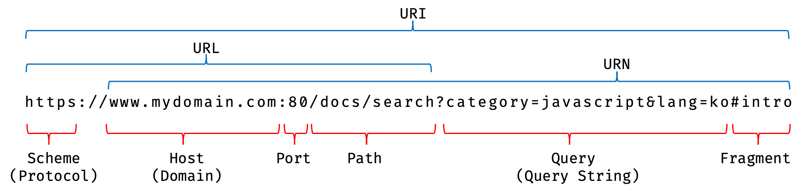
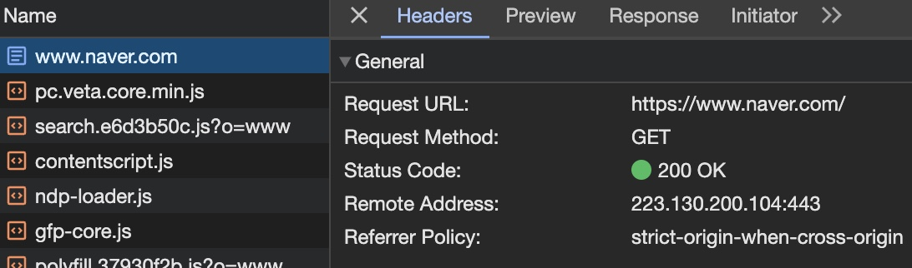

## 🔖 개요
웹 개발자로써 브라우저가 어떤 과정을 거쳐 렌더링되는지 알아두는 것은 중요하다.

브라우저가 HTML, CSS, 자바스크립트로 작성된 텍스트 문서를 어떻게 파싱하여 브라우저에 렌더링하는지 알아보자.

## 🔖 브라우저 렌더링 과정
브라우저는 다음과 같은 과정을 거쳐 렌더링을 수행한다.

1. 브라우저는 HTML, CSS, 자바스크립트, 이미지, 폰트 파일 등 렌더링에 필요한 리소스를 **요청**하고 서버로부터 **응답**을 받는다.
2. 브라우저의 렌더링 엔진은 서버로부터 응답된 HTML과 CSS를 파싱하여 DOM과 CSSOM을 생성하고 이들을 결합하여 렌더 트리를 생성한다.
3. 브라우저의 자바스크립트 엔진은 서버로부터 응답된 자바스크립트를 파싱하여 AST(Abstract Syntax Tree)를 생성하고, 바이트 코드로 변환하여 실행한다.
   - 이 때, 자바스크립트는 DOM API를 통해 DOM이나 CSSOM을 변경할 수 있다. 변경된 DOM과 CSSOM은 다시 렌더 트리로 결합 된다.
4. 렌더 트리를 기반으로 HTML 요소의 레이아웃(위치와 크기)을 계산하고 브라우저 화면에 HTML 요소를 페인팅한다.

### 📍 요청과 응답
브라우저의 핵심 기능은 필요한 리소스를 서버에 요청하고 응답받아 파싱 후 시각적으로 렌더링하는 것이다. 

**서버에 요청을 어떻게 전송할 수 있을까?**

브라우저의 주소창에 URL을 입력하면 URL의 호스트 이름이 DNS를 통해 IP 주소로 변환되고, 이 IP 주소를 갖는 서버에게 요청을 전송하게 된다. 



서버는 암묵적으로 `index.html` 을 클라이언트 측으로 응답하도록 되어 있다. 즉, `https://www.naver.com` 을 입력하는 것과 `https://www.naver.com/index.html` 을 입력하는 것과 같다. 정적 파일인 `index.html` 이 아닌 다른 파일을 요청하고 싶다면, `index.html` 대신 `data.json` 과 같이 요청할 정적 파일의 경로와 파일 이름을 URI의 호스트 부분 뒤 path 부분에 기술하면 된다.



개발자 도구의 Network 탭에서 요청과 응답을 확인할 수 있다.

`index.html` 을 비롯한 여러 CSS, 자바스크립트, 이미지 등 리소스 파일들도 응답된 것을 확인할 수 있다. 위 이미지와 같이 Naver에 접속할 시 `index.html` 만 요청하는 줄 알았는데, 요청하지도 않은 리소스 파일들은 왜 응답되었을까?

이는 브라우저 렌더링 엔진이 `index.html` 파일을 파싱하는 도중, **외부 리소스를 로드하는 태그를 만나면** HTML 파싱을 일시 중단하고 해당 리소스 파일을 서버에게 요청하기 때문이다.

## 🔖 HTTP 1.1과 HTTP 2.0
💡 HTTP(HyperText Transfer Protocol)란?
- 웹에서 브라우저가 서버와 통신하기 위한 프로토콜(규약)

### 📍 HTTP/1.1의 단점
`HTTP/1.1` 은 기본적으로 하나의 커넥션 당 하나의 요청과 응답만 처리한다. 여러개의 요청을 처리할 수 없기 때문에, HTML 문서 내에 포함된 태그에 의한 리소스 요청이 개별적으로 전송되고 응답 또한 개별적으로 전송된다.

따라서, `HTML/1.1` 은 리소스 동시 전송이 불가능한 구조이므로 응답 시간이 증가하게 된다.

하지만, `HTML/2.0` 은 여러 리소스를 동시에 전송할 수 있기 때문에 `HTML/1.1` 에 비해 페이지 로드 속도가 약 50% 정도 빠르다고 알려진다.

## 🔖 HTML 파싱과 DOM 생성
브라우저 요청에 의해 응답 받은 HTML 문서는 문자열로 이루어진 순수한 텍스트이다. 이를 브라우저에 렌더링하기 위해서는 HTML 문서를 **브라우저가 이해할 수 있는 자료구조(객체)** 로 변환하여 메모리에 저장해야 한다. 이렇게 만들어지는 자료 구조는 HTML 문서를 파싱한 결과물인 **DOM(Document Object Model)** 이라고 한다. 

## 🔖 CSS 파싱과 CSSOM 생성
link 태그의 href 어트리뷰트에 지정된 CSS 파일을 서버에 요청하여 로드한 CSS 파일이나, style 태그 내의 CSS를 **HTML과 동일한 파싱 과정**을 거치며 해석하여 CSSOM(CSS Object Model)을 생성한다. 이후 CSS 파싱을 완료하면, 잠시 파싱을 중단했던 지점부터 다시 파싱하여 DOM 생성을 재개한다.

💡 HTML의 파싱 과정?
- 바이트 -> 문자 -> 토큰 -> 노드 -> CSSOM

## 🔖 렌더 트리 생성
렌더링 엔진은 HTML을 파싱하여 DOM, CSS를 파싱하여 CSSOM를 생성한다. 그리고 DOM과 CSSOM은 렌더링을 위해 **렌더 트리**로 결합된다.

렌더 트리는 브라우저 화면에 렌더링되는 노드로만 구성된다. `display: none;` 으로 숨겨지는 요소는 렌더 트리에 포함되지 않는다.

렌더 트리를 이용하여 요소의 레이아웃을 계산하는 데에 사용할 수 있고, 화면에 픽셀을 렌더링하는 **페인팅** 처리에 입력된다.

브라우저의 렌더링 과정은 반복해서 실행될 수 있다.
다음과 같은 경우, 반복된 레이아웃 계산 및 페인팅이 재실행된다.

1. 자바스크립트에 의한 노드 추가 또는 삭제
2. 브라우저 창 리사이징에 의한 뷰포트 크기 변경
3. 요소의 레이아웃에 변경을 발생시키는 등의 스타일 변경

하지만, 계산과 페인팅이 반복되는 것은 성능에 악영향을 미치는 작업이므로 빈번하게 발생하지 않도록 조심해야 한다.

## 🔖 자바스크립트 파싱과 실행
HTML 문서를 파싱한 결과물로 DOM이 생성된다. DOM은 문서의 구조와 정보 뿐만이 아닌, 각 요소와 스타일 등을 변경시킬 수 있는 DOM API을 제공한다. 이를 통해 자바스크립트 코드에서 이미 생성된 DOM을 동적으로 조작할 수 있다.

자바스크립트 파일을 파싱하기 위해서는 **자바스크립트 엔진에 제어권을 넘겨야 한다.** 이후 자바스크립트 파싱과 실행이 종료되면 렌더링 엔진으로 다시 제어권이 넘어간다. 자바스크립트 엔진을 통해 자바스크립트 코드를 파싱하여 CPU가 이해할 수 있는 저수준 언어로 변환하고 실행하는 역할을 한다.

자바스크립트 엔진은 자바스크립트 해석 후 AST(Abstract Syntax Tree)를 생성한다. AST를 기반으로 인터프리터가 실행할 수 있는 중간 코드인 바이트코드를 생성하여 실행한다.

💡 자바스크립트 엔진의 종류
- 구글 크롬
- Node.js의 V8
- 파이어폭스의 SpiderMonkey
- 사파리의 JavaScriptCore

💡 토크나이징(tokenizing)
- 단순한 문자열인 자바스크립트 코드를 어휘 분석 -> **문법적 의미를 갖는 코드의 최소 단위인 토큰들**로 분해

💡 파싱(Parsing)과 바이트코드 생성 및 실행
- 토큰들의 집합을 구분 분석 -> AST 생성
- AST에 의해 바이트 코드로 변환되어 인터프리터로 실행됨

## 🔖 리플로우와 리페인트
변경된 렌더 트리를 기반으로 레이아웃과 페인트 과정을 거쳐 브라우저 화면에 다시 렌더링하는 과정을 리플로우와 리페인트이라고 한다.

### 📍 리플로우와 리페인트의 차이
리플로우는 레이아웃 계산을 다시 하는 것을 말하며 노드 추가/삭제, 요소의 크기/위치 변경, 윈도우 리사이징 등 레이아웃에 영향을 주는 변경이 발생한 경우에 실행된다.

리페인트는 재결합된 렌더 트리를 기반으로 다시 페인트하는 것을 말한다.

리플로우와 리페인팅은 반드시 순차적으로 동시에 실행되는 것이 아니다. 레이아웃 변경이 없다면 리플로우가 아닌 리페인트만 실행된다.

## 🔖 자바스크립트 파싱에 의한 HTML 파싱 중단
렌더링 엔진과 자바스크립트 엔진은 병렬적으로 파싱을 하지 않고, 직렬적으로 파싱을 수행한다. 

브라우저는 위에서 아래 방향인 순차적(동기적)으로 HTML, CSS, 자바스크립트를 파싱하고 실행한다. 그렇기에 script 태그의 위치가 중요한다.


## 🔖 script 태그 async/defer 어트리뷰트
자바스크립트에 파싱에 의해 잠시 DOM 생산이 중단되는 문제를 해결하기 위해, HTML5부터 `script` 태그에 `async`와 `defer` 어트리뷰트가 추가되었다.

```html
<script async src="extern.js"></script>
<script defer src="extern.js"></script>
```
두 어트리뷰트는 `src` 어트리뷰트를 통해 외부 자바스크립트를 로드하는 경우에만 사용이 가능하다.

### 📍 async 어트리뷰트
HTML 파싱과 외부 자바스크립트 파일 로드를 비동기적으로 동시에 진행하도록 만들어준다. 단, 자바스크립트의 파싱과 실행은 자바스크립트 파일의 로드가 완료된 직후 진행되고 이때 HTML 파싱이 중단된다. 순서가 보장되지 않는 실행을 진행하므로 사용에 주의해야 한다.

### 📍 defer 어트리뷰트
`async` 어트리뷰트와 마찬가지로 파싱 및 js 로드를 동시에 진행한다. 하지만, 자바스크립트의 파싱과 실행흔 HTML 파싱이 완료된 직후인 DOM 생성 완료 후에 진행된다. 그렇기에 DOM 생성이 완료된 이후 실행되어야 할 자바스크립트에 사용하기에 유용하다.